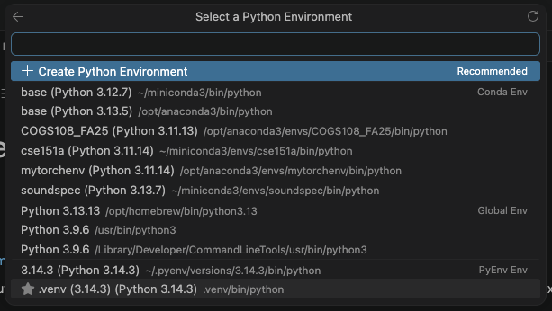

# Starting

> It may look like a lot, but it's super easy!

1. Open the folder in VSCode.

1. Open your terminal (`Command + J` on mac).

1. Create a Python virtual environment.

```bash
python -m venv .venv
```

1. Activate the virtual environment.

```
source ./.venv/bin/activate
```

1. Install the requirements from the requirements.txt file

```bash
python -m pip install -r requirements.txt
```

1. Open [`project.ipynb`](project.ipynb) and press run all.

1. When it asks you which kernel you'll use, select Python environments and select `.venv` (probably at the bottom).



Then click install.
